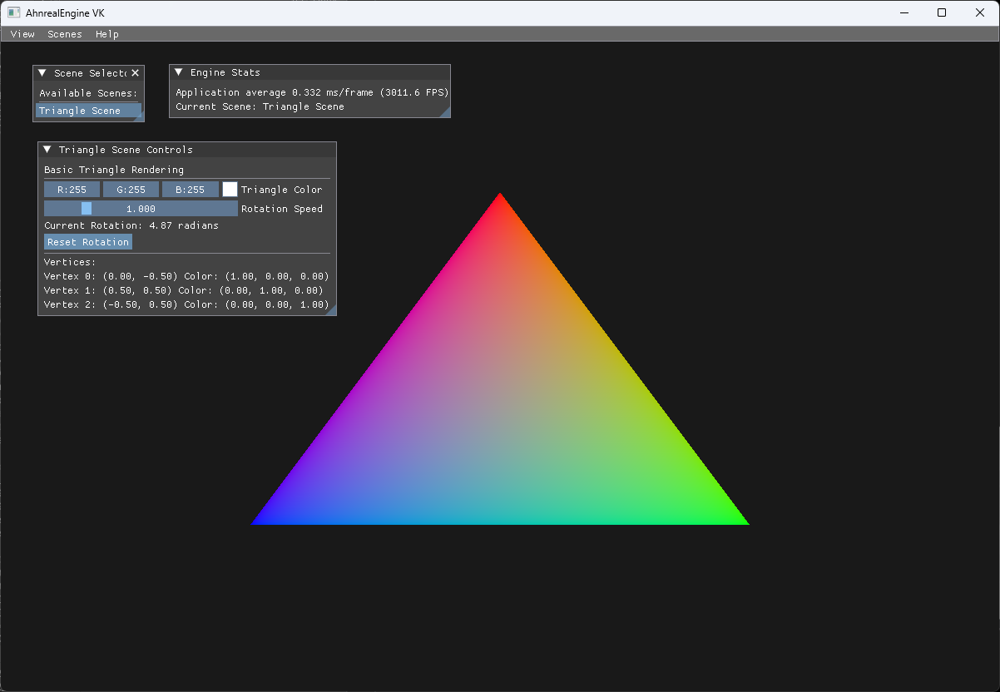

# AhnrealEngine VK 🎮

**Computer Graphics Learning Engine powered by Vulkan API**

AhnrealEngine VK는 컴퓨터 그래픽스와 Vulkan API를 학습하기 위한 모듈화된 렌더링 엔진입니다. 기본적인 삼각형 렌더링부터 고급 레이트레이싱까지, 다양한 그래픽스 기법을 실험하고 학습할 수 있는 플랫폼을 제공합니다.

## 📋 목차

- [프로젝트 개요](#-프로젝트-개요)
- [완성된 기능](#-완성된-기능)
- [스크린샷](#-스크린샷)
- [프로젝트 구조](#-프로젝트-구조)
- [빌드 방법](#-빌드-방법)
- [현재 구현 상태](#-현재-구현-상태)
- [로드맵](#-로드맵)
- [사용법](#-사용법)

## 🎯 프로젝트 개요

### 주요 목표
- **교육적 목적**: 컴퓨터 그래픽스 이론을 실제 구현으로 학습
- **모듈화**: 각 그래픽스 기법을 독립적인 씬으로 구현
- **실험 환경**: 새로운 렌더링 기법을 쉽게 테스트할 수 있는 프레임워크
- **성능 최적화**: Vulkan API의 장점을 활용한 고성능 렌더링

### 기술 스택
- **그래픽스 API**: Vulkan 1.3+
- **윈도우 시스템**: GLFW
- **수학 라이브러리**: GLM
- **UI 시스템**: Dear ImGui
- **3D 모델 로딩**: Assimp
- **텍스처 로딩**: STB, KTX
- **빌드 시스템**: CMake + vcpkg
- **컴파일러**: MSVC 2022+ / GCC 11+ / Clang 14+

## ✅ 완성된 기능

### 엔진 코어
- [x] **Application Framework**: 메인 루프 및 이벤트 처리
- [x] **Vulkan Device Management**: GPU 선택 및 논리 디바이스 생성
- [x] **Swap Chain**: 더블/트리플 버퍼링 지원
- [x] **Command Buffer Pool**: 커맨드 버퍼 관리 시스템
- [x] **Memory Management**: 버퍼/이미지 메모리 할당 및 관리

### 렌더링 시스템
- [x] **VulkanRenderer**: 렌더링 파이프라인 추상화
- [x] **Shader System**: GLSL 셰이더 로딩 및 컴파일
- [x] **Vertex Buffer Management**: 정점 데이터 관리
- [x] **Graphics Pipeline**: 렌더링 상태 관리

### UI & 씬 관리
- [x] **ImGui Integration**: 실시간 파라미터 조정 UI
- [x] **Scene Manager**: 동적 씬 전환 시스템
- [x] **Scene Selector UI**: 씬 선택 인터페이스
- [x] **Engine Stats Display**: FPS 및 성능 모니터링

### 기본 렌더링 씬
- [x] **Triangle Scene**: 기본 삼각형 렌더링
  - 정점 버퍼 생성
  - 그래픽스 파이프라인 설정
  - 실시간 색상/회전 조정

## 📷 스크린샷

### Triangle Scene

*기본 삼각형 렌더링 씬 - RGB 정점 색상과 실시간 UI 컨트롤*

## 📁 프로젝트 구조

```
AhnrealEngine_VK/
├── src/
│   ├── Engine/                 # 엔진 코어 시스템
│   │   ├── Core/
│   │   │   ├── Application.h/.cpp    # 메인 애플리케이션
│   │   │   └── ...
│   │   ├── Renderer/           # Vulkan 렌더링 시스템
│   │   │   ├── VulkanDevice.h/.cpp   # 디바이스 관리
│   │   │   ├── VulkanRenderer.h/.cpp # 렌더러
│   │   │   ├── VulkanSwapChain.h/.cpp # 스왑체인
│   │   │   └── ...
│   │   ├── Scene/              # 씬 관리 시스템
│   │   │   ├── Scene.h/.cpp          # 베이스 씬 클래스
│   │   │   └── ...
│   │   └── UI/                 # 사용자 인터페이스
│   │       ├── UISystem.h/.cpp       # ImGui 통합
│   │       └── ...
│   ├── Scenes/                 # 렌더링 씬 구현
│   │   ├── Basic/              # 기초 렌더링
│   │   │   └── TriangleScene.h/.cpp  # 삼각형 렌더링
│   │   ├── Rendering/          # 고급 렌더링 기법 (예정)
│   │   ├── Shader/             # 셰이더 실험 (예정)
│   │   ├── RayTracing/         # 레이트레이싱 (예정)
│   │   └── Simulation/         # 물리/유체 시뮬레이션 (예정)
│   ├── Shaders/                # GLSL 셰이더 파일
│   │   ├── triangle.vert       # 삼각형 정점 셰이더
│   │   ├── triangle.frag       # 삼각형 프래그먼트 셰이더
│   │   └── ...
│   └── main.cpp                # 엔트리 포인트
├── build/                      # 빌드 출력
├── vcpkg.json                  # 패키지 의존성
├── CMakeLists.txt              # 빌드 설정
└── README.md                   # 프로젝트 문서
```

## 🔧 빌드 방법

### 필수 요구사항
- **Vulkan SDK** 1.3.0+
- **CMake** 3.16+
- **C++17** 지원 컴파일러
- **Git**

### Windows (Visual Studio)
```bash
# 1. 저장소 클론
git clone [repository-url]
cd AhnrealEngine_VK

# 2. vcpkg를 통한 의존성 설치
# vcpkg.json이 자동으로 의존성을 관리합니다

# 3. 빌드 디렉토리 생성 및 설정
mkdir build
cd build
cmake .. -G "Visual Studio 17 2022"

# 4. 셰이더 컴파일 (수동)
mkdir shaders
"C:\VulkanSDK\[version]\Bin\glslangValidator.exe" -V ../src/Shaders/triangle.vert -o shaders/triangle.vert.spv
"C:\VulkanSDK\[version]\Bin\glslangValidator.exe" -V ../src/Shaders/triangle.frag -o shaders/triangle.frag.spv

# 5. Visual Studio에서 빌드
# AhnrealEngine_VK.sln 파일을 Visual Studio로 열어서 빌드
```

### Linux
```bash
# 1. 의존성 설치
sudo apt install vulkan-sdk libglfw3-dev

# 2. 빌드
mkdir build && cd build
cmake ..
make -j$(nproc)
```

## 📊 현재 구현 상태

### ✅ 완료된 작업
1. **프로젝트 구조 설계** - 모듈화된 아키텍처
2. **Vulkan 초기화** - 인스턴스, 디바이스, 스왑체인
3. **렌더링 파이프라인** - 기본 그래픽스 파이프라인
4. **ImGui 통합** - 실시간 UI 시스템
5. **씬 관리 시스템** - 동적 씬 전환
6. **기본 삼각형 렌더링** - 첫 번째 렌더링 씬

### 🔄 진행 중인 작업
- **빌드 시스템 최적화** - 자동 셰이더 컴파일 개선
- **오류 처리 강화** - Vulkan 검증 레이어 통합
- **문서화** - 코드 주석 및 가이드 작성

## 🚀 로드맵

### Phase 1: 기초 렌더링 (완료)
- [x] 엔진 아키텍처 설계
- [x] Vulkan 초기화 및 기본 렌더링
- [x] UI 시스템 구현
- [x] 삼각형 렌더링 씬

### Phase 2: 3D 렌더링 (다음 단계)
- [ ] **카메라 시스템**
  - 뷰/프로젝션 매트릭스
  - 1인칭/3인칭 카메라
  - 마우스/키보드 입력
- [ ] **3D 메시 렌더링**
  - OBJ/FBX 모델 로딩
  - 정점/인덱스 버퍼 최적화
  - 여러 오브젝트 렌더링
- [ ] **변환 시스템**
  - 월드/로컬 좌표계
  - 계층적 변환
  - 애니메이션 기초

### Phase 3: 텍스처 및 재질
- [ ] **텍스처 시스템**
  - 2D 텍스처 로딩 (PNG, JPG, KTX)
  - 밉맵 생성
  - 텍스처 아틀라스
- [ ] **기본 재질 시스템**
  - Diffuse/Specular 맵핑
  - 노멀 맵핑
  - 머티리얼 에디터 UI
- [ ] **조명 시스템**
  - Directional/Point/Spot 라이트
  - 블린-퐁 셰이딩
  - 다중 광원

### Phase 4: 고급 렌더링 기법
- [ ] **PBR (Physically Based Rendering)**
  - 메탈릭/러프니스 워크플로우
  - IBL (Image-Based Lighting)
  - 큐브맵 및 HDRI
- [ ] **그림자 시스템**
  - 그림자 맵핑 (Shadow Mapping)
  - 캐스케이드 섀도우 맵
  - 소프트 섀도우
- [ ] **포스트 프로세싱**
  - HDR 톤 맵핑
  - 블룸 (Bloom)
  - SSAO (Screen Space Ambient Occlusion)
  - 안티앨리어싱 (FXAA/TAA)

### Phase 5: 고급 기능
- [ ] **컴퓨트 셰이더**
  - GPU 파티클 시스템
  - 절차적 생성
  - 병렬 컴퓨팅 실험
- [ ] **고급 셰이딩**
  - 서브서피스 스캐터링
  - 셸 셰이딩 (모피/잔디)
  - 볼류메트릭 렌더링
- [ ] **최적화**
  - 프러스텀 컬링
  - 오클루전 컬링
  - LOD (Level of Detail)
  - GPU-Driven 렌더링

### Phase 6: 레이트레이싱 (RTX)
- [ ] **하드웨어 레이트레이싱**
  - Vulkan RT 확장 사용
  - BLAS/TLAS 구축
  - 레이트레이싱 파이프라인
- [ ] **글로벌 일루미네이션**
  - 레이트레이스드 리플렉션
  - 레이트레이스드 섀도우
  - 패스트레이싱
- [ ] **디노이징**
  - AI 기반 디노이징
  - 시공간 필터링

### Phase 7: 시뮬레이션
- [ ] **물리 시뮬레이션**
  - 강체 역학
  - 유체 시뮬레이션
  - 천 시뮬레이션
- [ ] **절차적 생성**
  - 지형 생성
  - 도시 생성
  - 식물 생성

## 🎮 사용법

### 기본 실행
```bash
cd build/Debug  # 또는 Release
./AhnrealEngine_VK.exe
```

### UI 사용법
1. **씬 선택**: 상단 메뉴 > Scenes 에서 원하는 씬 선택
2. **파라미터 조정**: 각 씬별 컨트롤 패널에서 실시간 조정
3. **성능 모니터링**: Engine Stats 창에서 FPS 및 성능 확인

### 새로운 씬 추가하기
1. `src/Scenes/[카테고리]/` 에 새 씬 클래스 생성
2. `Scene` 베이스 클래스 상속
3. `Application.cpp`에서 씬 등록
4. 빌드 후 UI에서 선택 가능